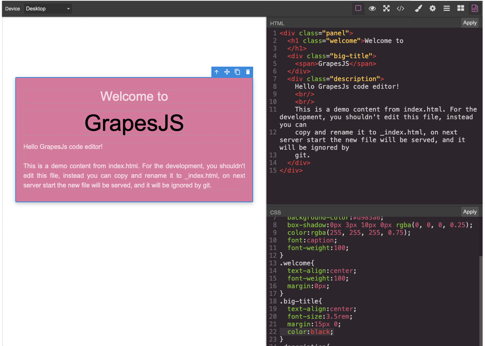

# Grapesjs Code Editor

When a component is selected, this plugin allows you to edit the HTML code and 
CSS code, and save them.



## Usage
[demo](https://codesandbox.io/p/sandbox/94xdwf)
```javascript
import grapesjs from 'grapesjs';
import grapesjsParserPostcss from 'grapesjs-parser-postcss';
import 'grapesjs/dist/css/grapes.min.css';
import grapesjsCodeEditor from 'grapesjs-code-editor';
import 'grapesjs-code-editor/dist/style.css';

window.editor = grapesjs.init({
  height: '100%',
  container: '#gjs',
  fromElement: true,
  storageManager: false,
  plugins: [grapesjsCodeEditor, grapesjsParserPostcss],
});

const pn = window.editor.Panels;
const panelViews = pn.addPanel({id: 'views'});
panelViews.get('buttons').add([{
  attributes: { title: 'Open Code' },
  className: 'fa fa-file-code-o',
  command: 'open-code',
  togglable: false, //do not close when button is clicked again
  id: 'open-code'
}]);
```

## Development

```sh
$ git clone https://github.com/allenhwkim/grapesjs-code-editor.git
$ cd grapesjs-code-editor
$ npm i
$ npm start
```

## License
MIT